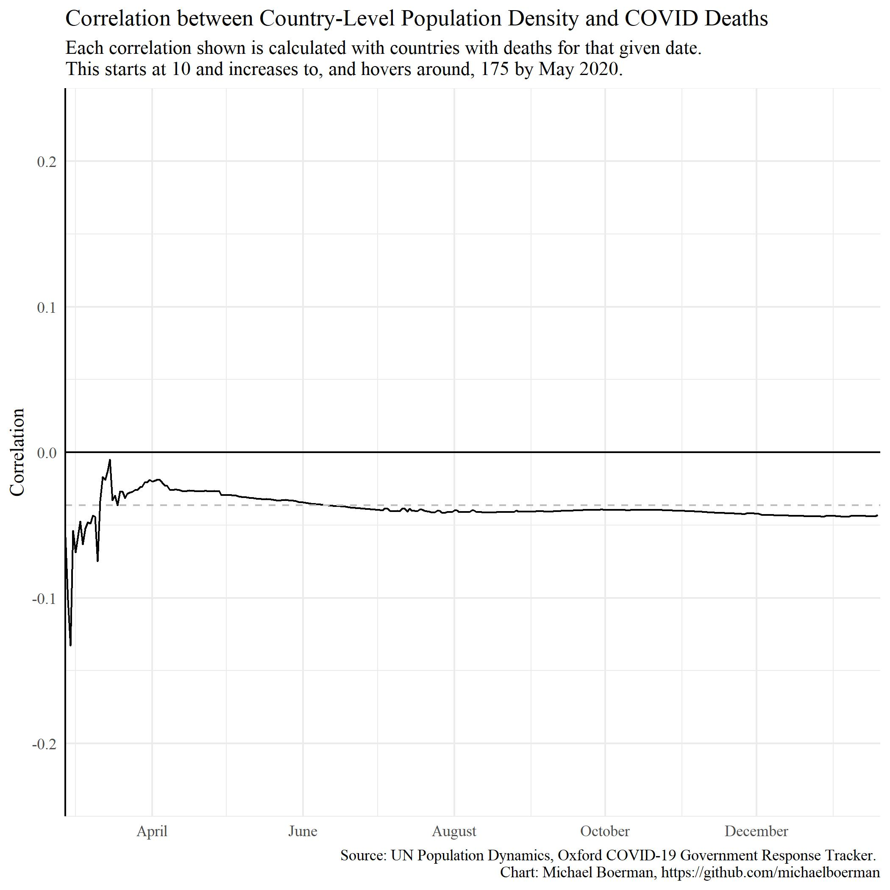
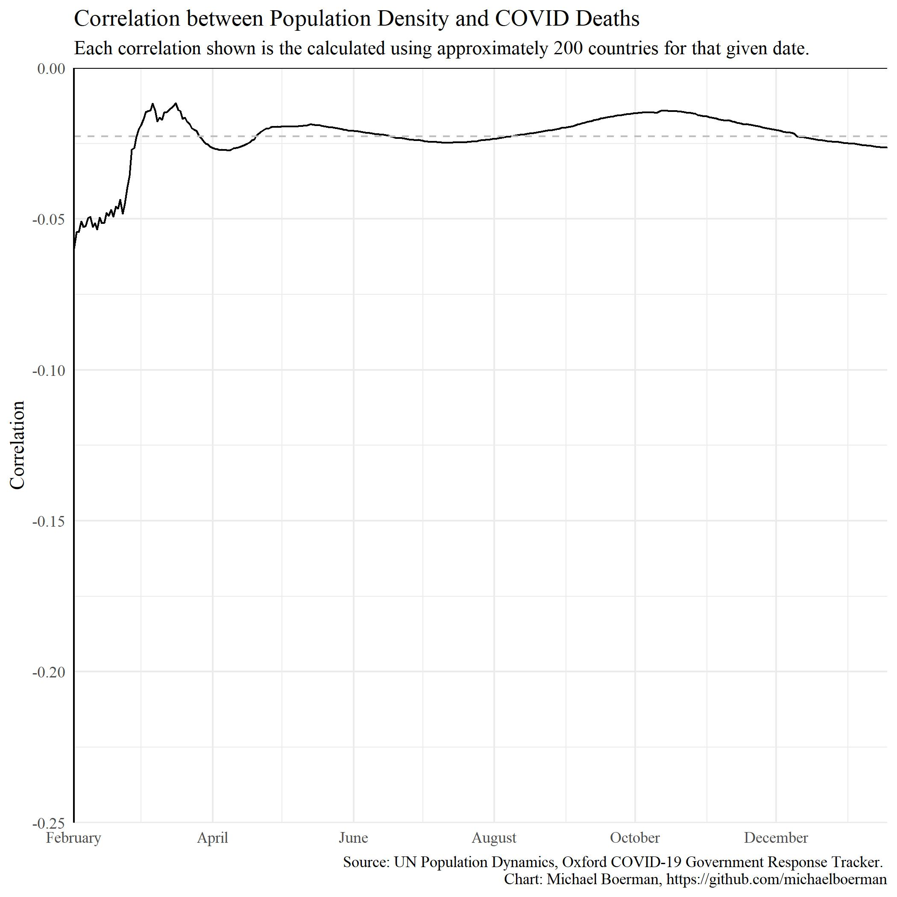
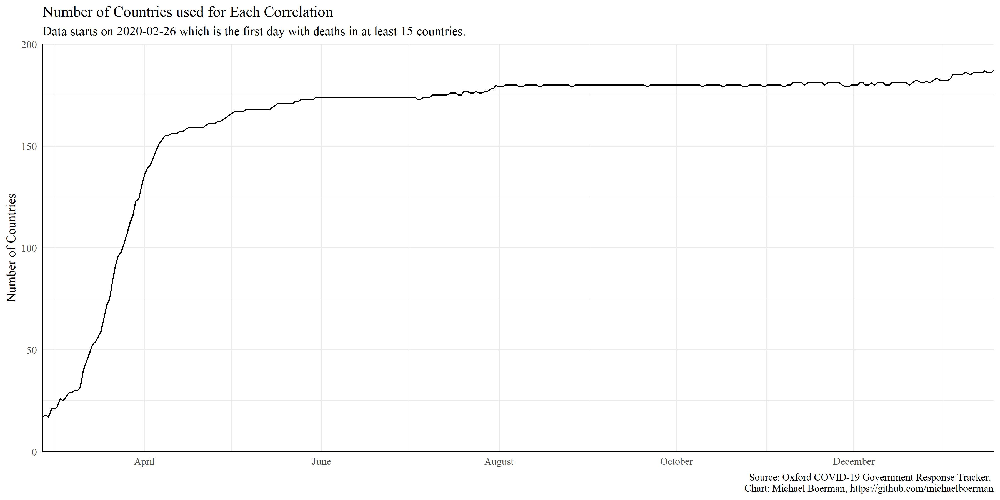

# covid_correlations
This repository supports the article written on Medium about correaltion between population desnity and COVID deaths or cases. 

I have included two Rmd files: one rough draft as I explored the data, and one polished. I want to include the messy, original copy for the sake of learning and exposure to the process. It's easy to see nice code on the internet and feel bad comparing to your sloppy drafts!

