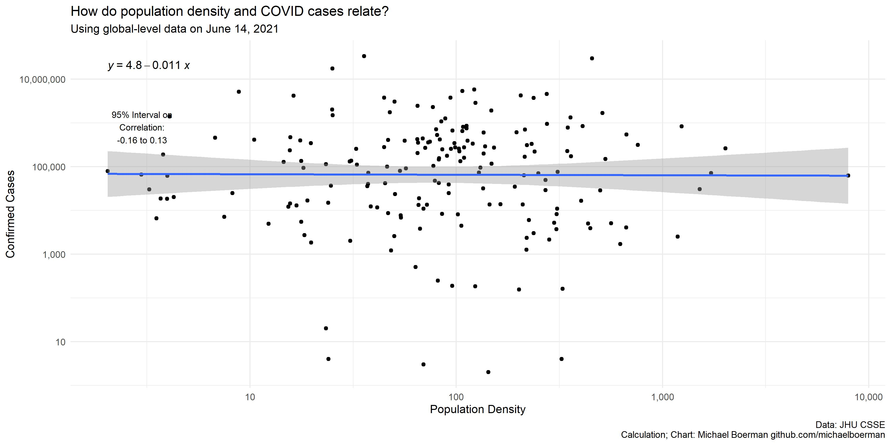
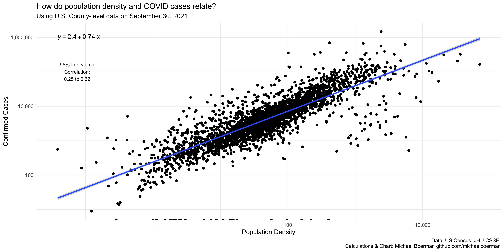
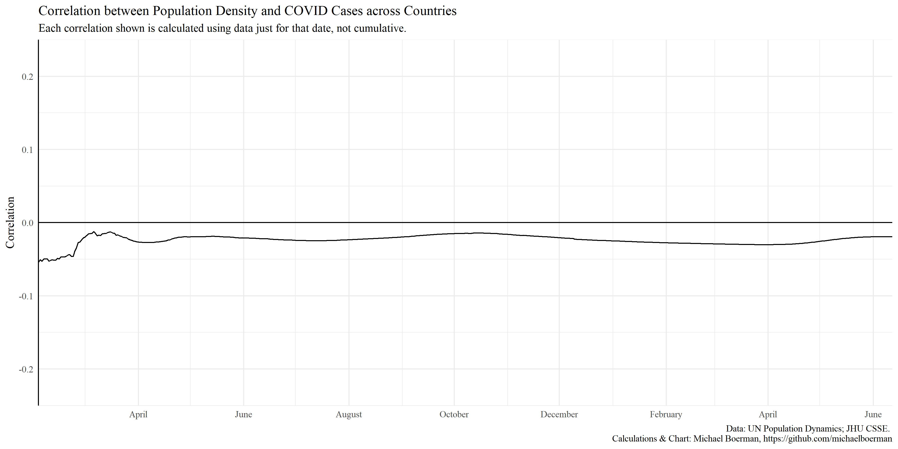
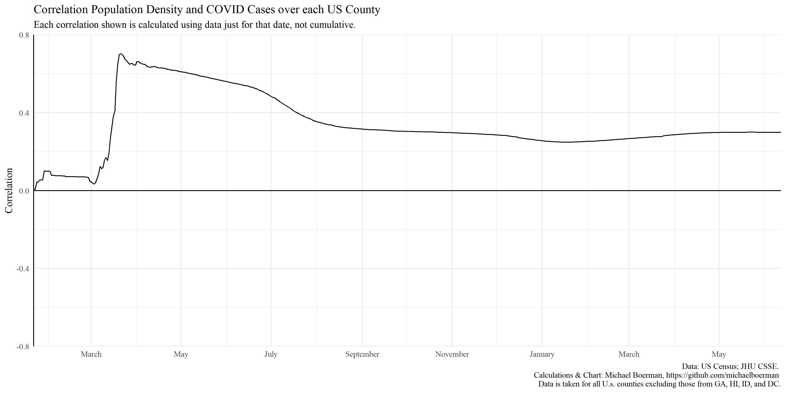
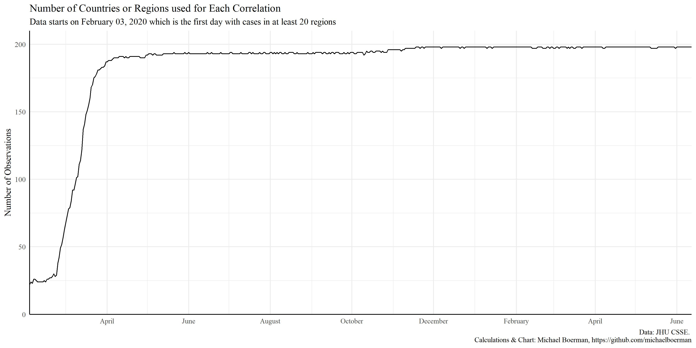

# covid_correlations
This repository supports the article written on Medium about correlation between population density and COVID deaths or cases. 

There are two parallel files: one for countRies, and one for counties. In a more robust world, I may have put the plotting functions in a third script and just call them. However, in the vein of data exploration, they exist parallel.  

